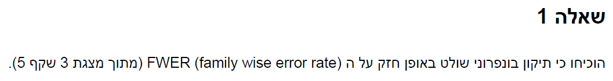
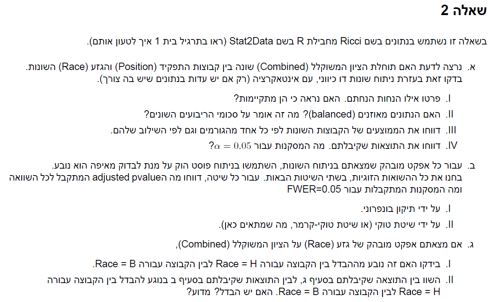
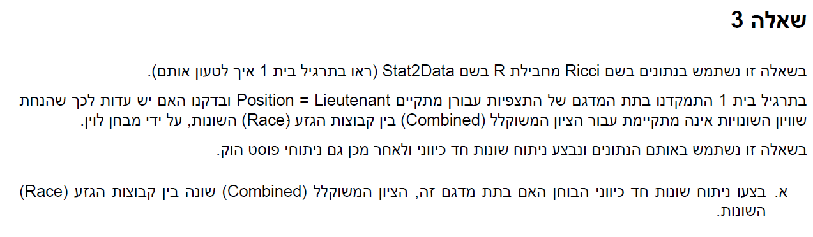
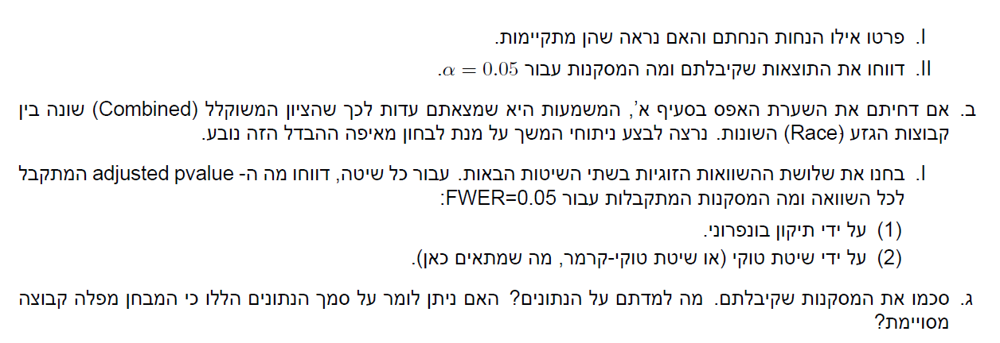
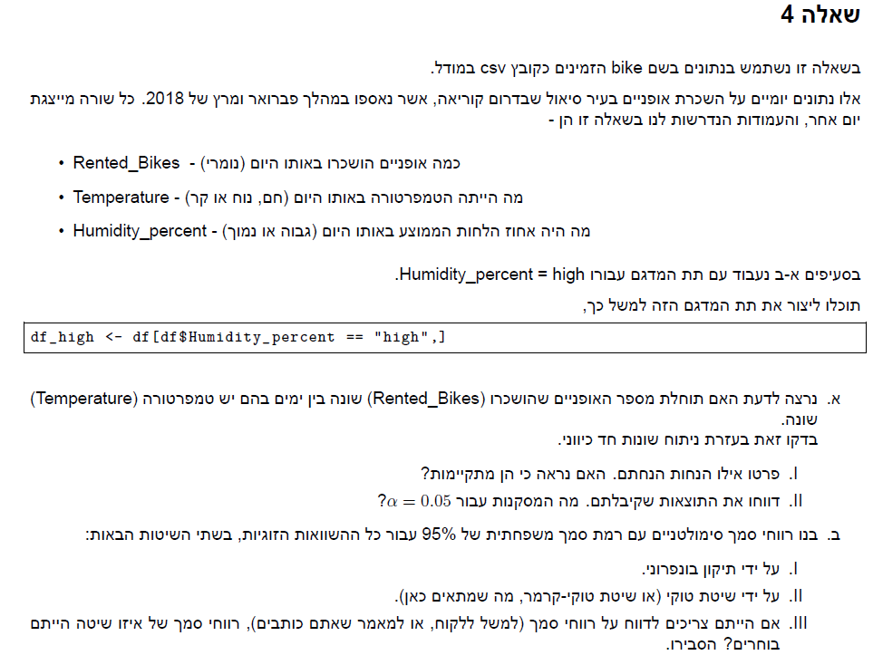
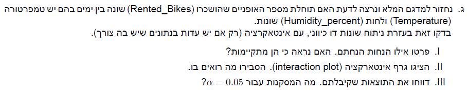
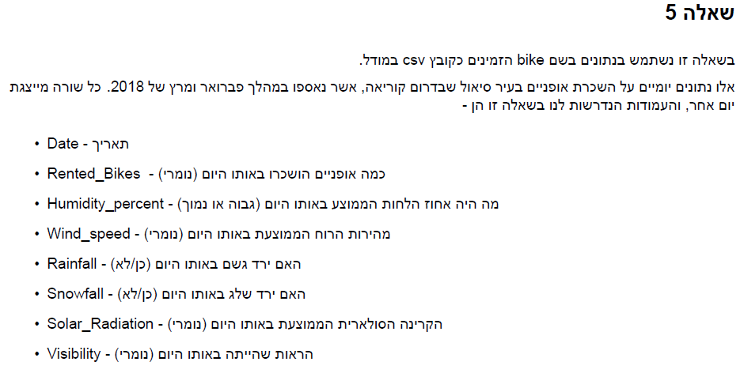
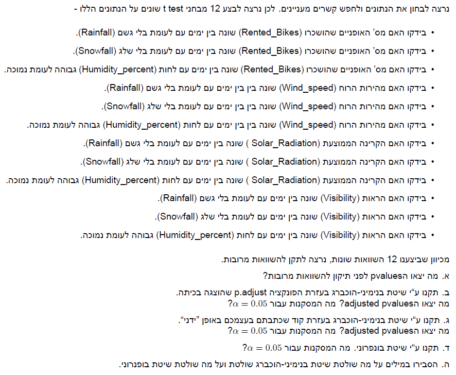

```{r setup, include=FALSE}
knitr::opts_chunk$set(echo = TRUE)
```

## R Markdown

This is an R Markdown document. Markdown is a simple formatting syntax for authoring HTML, PDF, and MS Word documents. For more details on using R Markdown see <http://rmarkdown.rstudio.com>.

When you click the **Knit** button a document will be generated that includes both content as well as the output of any embedded R code chunks within the document. You can embed an R code chunk like this:

# Q.1 



$$
\textrm{lets take a look at the following expression:} 
\\ Pr(\cup_{m=1}^MA_m) \le \sum_{m=1}^MPr(A_m)
\\ the \,RHS=LHS \,\, iff  \, A_i,A_j  \, are  \, independet  \, \,\forall i,j
\\ \textrm{thus we only need to prove for the case where } A_i,A_j \textrm{ are independet}
\\ \textrm{in this case:}
\\FWER = Pr_{H_0}(R > 0) =1 - \Pi_{i=1}^MPr_{H_0}(R_i= 0) = 1- (1-\alpha^*)^m  \Rightarrow 1- FWER = (1-\alpha^*)^m \Rightarrow
\\ (1- FWER)^{\frac{1}{m}} = 1- \alpha^* \Rightarrow \alpha^* = 1-(1- FWER)^{\frac{1}{m}} > 1-(1- FWER) = FWER
$$


# Q.2



**a**

```{r}
library(tidyverse)
library(Stat2Data)
library(glue)
library(lawstat)
#see if intercation is necceserty
data(Ricci)
full_model <- lm(Combine ~ Position*Race,data = Ricci)
no_inter_model <- lm(Combine ~ Position + Race,data = Ricci)
anov_test <- anova(no_inter_model,full_model)
pv <- anov_test[["Pr(>F)"]][2]
glue("interaction relevence p value is: {pv} therefore we will not reject the null, meaning the interaction is not needed")

#assumptions
glue("we assume equal variance")
levene_test <-levene.test(Ricci$Combine,Ricci$Race:Ricci$Position,location = "mean")
glue("pvalue for levene test is {round(levene_test$p.value,4)} therefore we will not reject the null and conclude equal varicane")

glue("we assume normality of the residuals")
ggplot(Ricci,aes(sample = Combine - predict(no_inter_model,Ricci[c("Position","Race")]))) +
  stat_qq()+
  stat_qq_line()+
  ggtitle("error normality check")

glue("looks ok")
glue("we also assume independece but we cant check it")

#balance check
Ricci %>% 
  group_by(Position,Race) %>%
  summarize(n())
glue("we can see that the groups are unbalanced")
glue("it mneas that SST =/= SSA +SSB + SSAB + SSE")

#show means
Ricci %>% 
  group_by(Position,Race) %>%
  summarize(mean(Combine))

Ricci %>% 
  group_by(Position) %>%
  summarize(mean(Combine))

Ricci %>% 
  group_by(Race) %>%
  summarize(mean(Combine))

#anova for Position
Pos_model <- lm(Combine ~ Race ,data = Ricci)
anov_test_pos <- anova(Pos_model,no_inter_model)
pv_pos <- anov_test_pos[["Pr(>F)"]][2]
glue("interaction relevence p value is: {pv_pos} therefore we will not reject the null, meaning that position has no effect on test results")

#anova for Race
Race_model <- lm(Combine ~ Position ,data = Ricci)
anov_test_R <- anova(Race_model,no_inter_model)
pv_R <- anov_test_R[["Pr(>F)"]][2]
glue("interaction relevence p value is: {pv_R} therefore we will reject the null, meaning that race has an effect on test results")
```

**b**

```{r}
library(multcomp)
contr <- rbind(
  "Race H - Race B" = c(-1,1,0),
  "Race W - Race B" = c(-1,0,1),
  "Race W - Race H" = c(0,-1,1)
)
aov_model <-aov(Combine ~ Race,data = Ricci)
pair_wise <- glht(aov_model, linfct = mcp(Race = contr))
glue("bonferroni method results:")
summary(pair_wise, test = adjusted(type = "bonf"))
glue("Tukey method results:")
summary(glht(aov_model, mcp(Race = "Tukey")), test = univariate())
glue("we can conculde from both methods that there is a difference between: whites and blacks, whites and hispanics for FWER = 0.05 ")
```

**c**
```{r}
W_C <- Ricci %>% 
  filter(Race == "W") %>% 
  pull(Combine)
B_C <- Ricci %>% 
  filter(Race == "B") %>% 
  pull(Combine)
glue(" the difference is {mean(W_C) - mean(B_C)} which is the same as in the test, because it is calculated the same way")
```


# Q.3




**זה זהה לשאלה 2...**

# Q.4 




**a**

```{r}
bike <- read_csv("bike.csv")
bike <- bike %>%
  dplyr::select(Rented_Bikes,Temperature,Humidity_percent) %>%
  filter(Humidity_percent == "high") %>%
  mutate(across(c(Temperature,Humidity_percent),as.factor))
bike_aov <- aov(Rented_Bikes~Temperature,data = bike)
#assumptions
glue("we assume equal variance")
levene_test <-levene.test(bike$Rented_Bikes,bike$Temperature,location = "mean")
glue("pvalue for levene test is {round(levene_test$p.value,4)} therefore we will not reject the null and conclude equal varicane")

glue("we assume normality of the residuals")
plot(bike_aov)

glue("qqplot looks ok")
glue("we also assume independece but we cant check it")
#pvalue
pv_bike <- summary(bike_aov)[[1]][["Pr(>F)"]][1]
glue("pvalue is: {pv_bike} therefore we will reject the null and conclude that there is a difference in bike rentals for different Temperatures")
```

**b**

```{r}
contr <- rbind(
  "Temperature hot - Temperature cold" = c(-1,1,0),
  "Temperature nice - Temperature cold" = c(-1,0,1),
  "Temperature nice - Temperature hot" = c(0,-1,1)
)
glue("bonferonni ci's method")
pairwise_res <- glht(bike_aov,linfct = mcp(Temperature = contr))
pairwise_ci <- confint(pairwise_res,level = 1- (0.05/3) ,calpha = univariate_calpha())
pairwise_ci
glue("Tukey - Kramer method")
TukeyHSD(bike_aov)
glue("i would report Tukey - Kramer CI because they are smaller")
```

**c**

```{r}
bike <- read_csv("bike.csv")
bike <- bike %>%
  dplyr::select(Rented_Bikes,Temperature,Humidity_percent) %>%
  mutate(across(c(Temperature,Humidity_percent),as.factor))

bike %>%
  group_by(Temperature,Humidity_percent) %>%
  summarize(n())
glue("we have unblaced groups")

#see if intercation is necceserty
full_model <- lm(Rented_Bikes ~ Temperature*Humidity_percent,data = bike)
no_inter_model <- lm(Rented_Bikes ~ Temperature + Humidity_percent,data = bike)
anov_test <- anova(no_inter_model,full_model)
pv <- anov_test[["Pr(>F)"]][2]
glue("interaction relevence p value is: {pv} therefore we will reject the null, meaning the interaction is needed")

#assumptions
glue("we assume equal variance")
levene_test <-levene.test(bike$Rented_Bikes,bike$Temperature:bike$Humidity_percent,location = "mean")
glue("pvalue for levene test is {round(levene_test$p.value,4)} therefore we will not reject the null and conclude equal varicane")

glue("we assume normality of the residuals")
ggplot(bike,aes(sample = Rented_Bikes - predict(no_inter_model,bike[c("Temperature","Humidity_percent")]))) +
  stat_qq()+
  stat_qq_line()+
  ggtitle("error normality check")

glue("looks ok")
glue("we also assume independece but we cant check it")

Rented_Bikes_mean <- bike %>%
  group_by(Temperature,Humidity_percent) %>%
  summarize(mean_group = mean(Rented_Bikes))

Rented_Bikes_mean %>%
  ggplot() +
  aes(x = Humidity_percent,y = mean_group, color = Temperature)+
  geom_line(aes(group = Temperature))+
  geom_point()
glue("we can see in this graph that the lines are not parallel meaning we have a different slope for each interaction so the interaction does have an effect")
```

# Q.5 




```{r}

```

