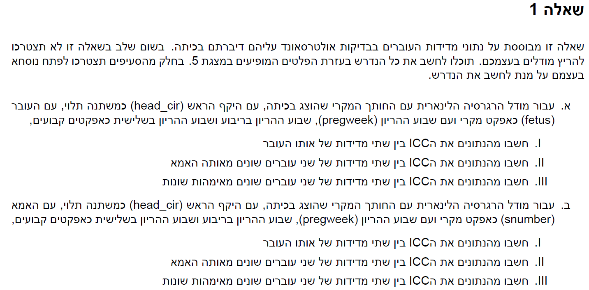
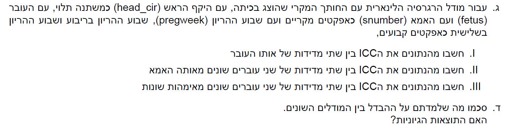
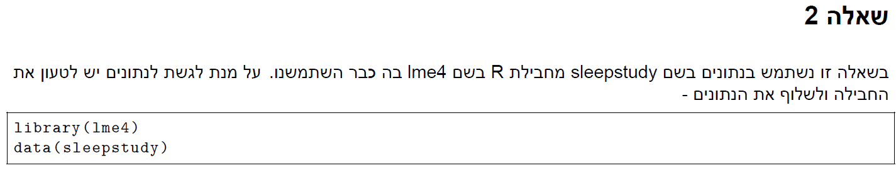
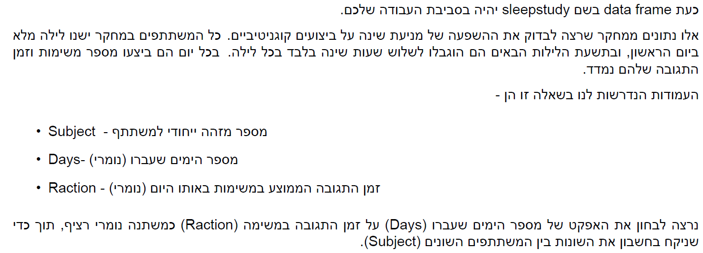
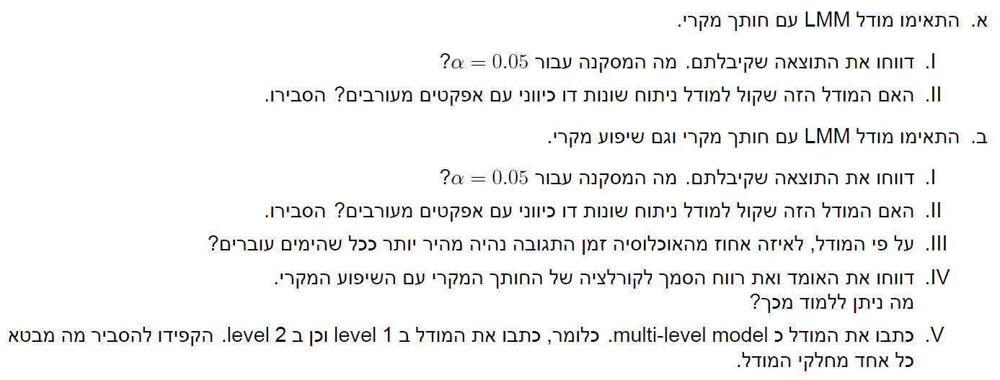

```{r setup, include=FALSE}
knitr::opts_chunk$set(echo = TRUE)
```

# Q1




## a

$$
1. \ \rho = \frac{\sigma_a^2}{\sigma_a^2 + \sigma_\varepsilon^2} = \frac{61.39}{61.39+44.33}=0.58
\\ 
2. \ \rho = cov(Y_{kij},Y_{ki'j'}) = 0 \quad(i \ne i')
\\ 
3. \ \rho = cov(Y_{kij},Y_{k'i'j'}) = 0 \quad(k \ne k')
$$

## b

$$
1. \ \rho = \frac{\sigma_a^2}{\sigma_a^2 + \sigma_\varepsilon^2} = \frac{44.69}{44.69+61.96}=0.419
\\ 
2. \ \rho = \frac{\sigma_a^2}{\sigma_a^2 + \sigma_\varepsilon^2} = \frac{44.69}{44.69+61.96}=0.419
\\ 
3. \ \rho = cov(Y_{kij},Y_{k'i'j'}) = 0 \quad(k \ne k')
$$

## c

$$
1. \ \rho = \frac{\sigma_a^2+sigma_b^2}{\sigma_a^2+sigma_b^2 + \sigma_\varepsilon^2} = \frac{37.59+23.54}{37.59+23.54+44.42}=0.579
\\ 
2. \ \rho = \frac{\sigma_b^2}{\sigma_a^2+sigma_b^2 + \sigma_\varepsilon^2} = \frac{23.54}{7.59+23.54+44.42}=0.223
\\ 
3. \ \rho = cov(Y_{kij},Y_{k'i'j'}) = 0 \quad(k \ne k')
$$

## d

המודל הראשון מניח כי השונות היא עבור העוברים

המודל השני מניח כי השונות נובעות מהאמהות

והמודל השלישי מניח כי עבור כל עובר וכל אמא יש שונות אחרת

התוצאות לא כלכך מסתדרות שכן זה מוזר שהשונות עבור המודל הראשון גדולה מזאת של המודל השלישי.

# Q2






## a


## b


